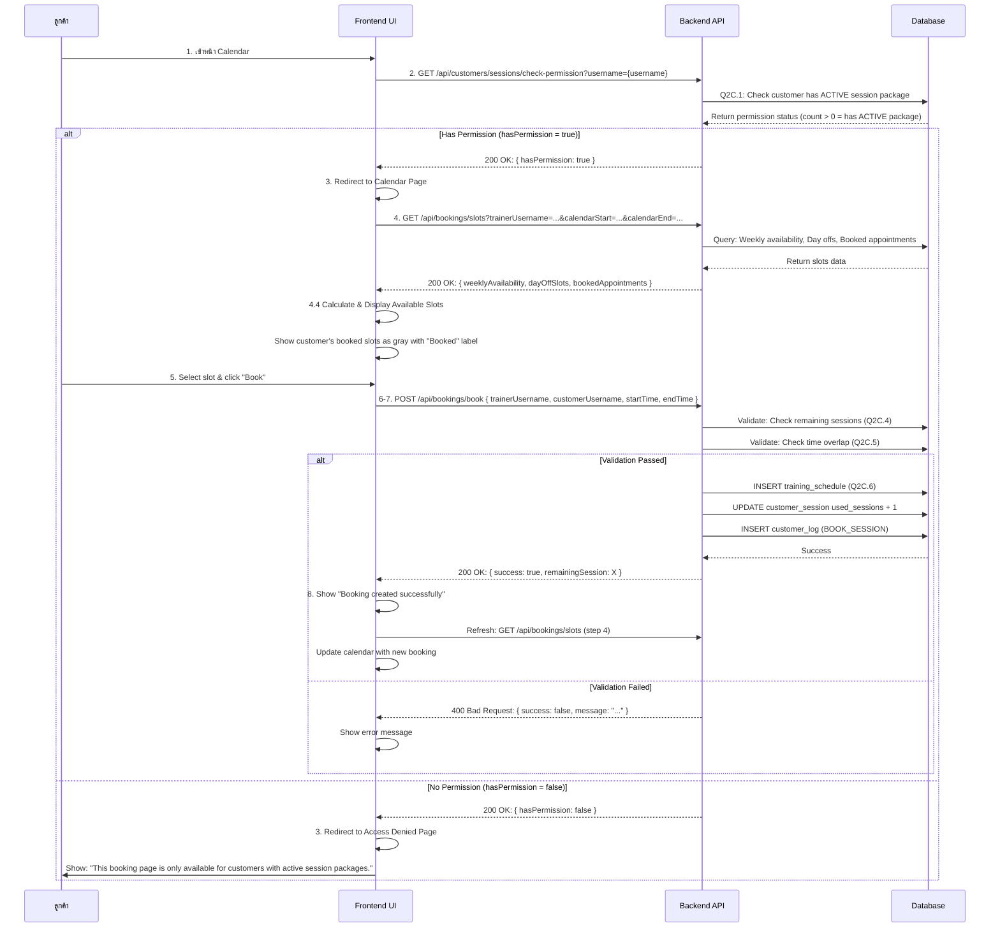

# 📅 Booking Flow - Frontend Implementation Guide

> **สำหรับ Frontend Developer**  
> Use Case 3C: จองเวลาออกกำลังกายกับเทรนเนอร์  
> Base URL: `http://localhost:8000`  
> Updated: October 31, 2025

---

## 📋 Table of Contents

1. [Overview](#overview)
2. [Complete Flow Diagram](#complete-flow-diagram)
3. [Step-by-Step Implementation](#step-by-step-implementation)
4. [API Endpoints Reference](#api-endpoints-reference)
5. [Error Handling](#error-handling)
6. [UI/UX Recommendations](#uiux-recommendations)

---

## Overview

การจองนัดหมายกับเทรนเนอร์ประกอบด้วย **8 ขั้นตอนหลัก** ที่ Frontend ต้องดำเนินการ:

1. ลูกค้าเข้าสู่หน้า "Calendar"
2. ตรวจสอบสิทธิ์การเข้าถึง (Check Permission)
3. แสดงหน้า Calendar หรือ Access Denied
4. ดึงข้อมูล Booking Slots
5. ลูกค้าเลือก Slot และกดปุ่ม "Book"
6. ตรวจสอบสิทธิ์และความพร้อม (Server-side validation)
7. บันทึกการจอง
8. แสดงผลลัพธ์และรีเฟรชปฏิทิน

---

## Complete Flow Diagram



---

## Step-by-Step Implementation

### Step 1: ลูกค้าเข้าสู่หน้า "Calendar"

**Frontend Action:**
- User คลิกเมนู "Calendar" หรือ "Book Appointment"
- ดึง `username` จาก authentication state (localStorage หรือ context)

---

### Step 2: ตรวจสอบสิทธิ์การเข้าถึง

**API Endpoint:** `GET /api/customers/sessions/check-permission`

**Query Parameters:**
- `username` (string, required): ชื่อ username ของลูกค้า

**Request Example:**
```javascript
const checkBookingPermission = async (username) => {
  const response = await fetch(
    `http://localhost:8000/api/customers/sessions/check-permission?username=${username}`,
    {
      method: 'GET',
      headers: {
        'Authorization': `Bearer ${getToken()}`,
        'Content-Type': 'application/json'
      }
    }
  );
  
  const data = await response.json();
  return data.result; // { hasPermission: boolean, canBook: boolean }
};
```

**Response (200 OK):**
```json
{
  "status": "success",
  "status_code": 200,
  "message": "Permission check completed",
  "result": {
    "hasPermission": true,
    "canBook": true
  }
}
```

**Business Logic (Backend):**
```sql
-- Q2C.1: ตรวจสอบสิทธิ์การเข้าถึงฟังก์ชันการจองก่อนโหลดปฏิทิน
-- ตรวจสอบว่า Customer มีแพ็กเกจ Sessions แบบ ACTIVE หรือไม่
-- หมายเหตุ: ถ้าทำครบแล้วจะเปลี่ยน status เป็น 'COMPLETED' โดยอัตโนมัติ
SELECT COUNT(id) as has_permission
FROM customer_sessions
WHERE customer_username = ?
  AND status = 'ACTIVE';
-- ถ้า has_permission > 0 แสดงว่ามีแพ็กเกจ ACTIVE
```

---

### Step 3: แสดงหน้า Calendar หรือ Access Denied

**Frontend Logic:**
```javascript
const CalendarPage = () => {
  const [hasPermission, setHasPermission] = useState(null);
  const { username } = useAuth(); // Get from auth context
  
  useEffect(() => {
    const checkPermission = async () => {
      const result = await checkBookingPermission(username);
      setHasPermission(result.hasPermission);
    };
    
    checkPermission();
  }, [username]);
  
  // Loading state
  if (hasPermission === null) {
    return <LoadingSpinner />;
  }
  
  // No permission - Redirect to Access Denied
  if (!hasPermission) {
    return (
      <AccessDenied 
        message="This booking page is only available for customers with active session packages. Please purchase a session package before booking."
      />
    );
  }
  
  // Has permission - Show calendar
  return <BookingCalendar username={username} />;
};
```

---

### Step 4: ดึงข้อมูล Booking Slots

**API Endpoint:** `GET /api/bookings/slots`

**Query Parameters:**
- `trainerUsername` (string, required): ชื่อ username ของเทรนเนอร์
- `customerUsername` (string, optional): ชื่อ username ของลูกค้า (เพื่อดูนัดของตัวเอง)
- `calendarStart` (string, required): วันที่เริ่มต้น (RFC3339: `2025-11-01T00:00:00Z`)
- `calendarEnd` (string, required): วันที่สิ้นสุด (RFC3339: `2025-11-30T23:59:59Z`)

**Request Example:**
```javascript
const getBookingSlots = async (trainerUsername, customerUsername, calendarStart, calendarEnd) => {
  const params = new URLSearchParams({
    trainerUsername,
    customerUsername,
    calendarStart,
    calendarEnd
  });
  
  const response = await fetch(
    `http://localhost:8000/api/bookings/slots?${params}`,
    {
      method: 'GET',
      headers: {
        'Authorization': `Bearer ${getToken()}`,
        'Content-Type': 'application/json'
      }
    }
  );
  
  const data = await response.json();
  return data.result;
};
```

**Response (200 OK):**
```json
{
  "status": "success",
  "status_code": 200,
  "message": "Booking slots retrieved successfully",
  "result": {
    "trainerUsername": "trainer1",
    "calendarStart": "2025-11-01T00:00:00Z",
    "calendarEnd": "2025-11-30T23:59:59Z",
    "weeklyAvailability": [
      {
        "dayOfWeek": "MONDAY",
        "startTime": "09:00:00",
        "endTime": "17:00:00"
      },
      {
        "dayOfWeek": "TUESDAY",
        "startTime": "09:00:00",
        "endTime": "17:00:00"
      }
    ],
    "dayOffSlots": [
      {
        "startTime": "2025-11-06T00:00:00Z",
        "endTime": "2025-11-06T23:59:59Z"
      }
    ],
    "bookedAppointments": [
      {
        "startTime": "2025-11-01T09:00:00Z",
        "endTime": "2025-11-01 10:00:00Z",
        "customerUsername": "cust01"
      },
      {
        "startTime": "2025-11-03T10:00:00Z",
        "endTime": "2025-11-03T11:00:00Z",
        "customerUsername": "cust02"
      }
    ],
    "customerBookings": [
      {
        "startTime": "2025-11-01T09:00:00Z",
        "endTime": "2025-11-01T10:00:00Z",
        "available": false,
        "isBooked": true,
        "bookedBy": "cust01",
        "slotType": "booked"
      }
    ]
  }
}
```

**Business Logic (Backend):**
```sql
-- Q2C.2: ดึงเวลาทำงานประจำสัปดาห์
SELECT day_of_week, start_time, end_time
FROM training_availabilities
WHERE trainer_username = ?;

-- Q2C.3: ดึงวันหยุด
SELECT start_time, end_time
FROM training_schedules
WHERE trainer_username = ?
  AND schedule_type = 'DAY_OFF'
  AND start_time < ?
  AND end_time > ?;

-- Q2C.4: ดึงนัดที่ถูกจองแล้ว
SELECT start_time, end_time, customer_username
FROM training_schedules
WHERE trainer_username = ?
  AND schedule_type = 'APPOINTMENT'
  AND start_time < ?
  AND end_time > ?;
```

---

### Step 4.4: คำนวณและแสดง Available Slots

**Frontend Logic:**
```javascript
const calculateAvailableSlots = (weeklyAvailability, dayOffSlots, bookedAppointments, calendarStart, calendarEnd) => {
  const slots = [];
  const sessionDuration = 2 * 60; // 2 hours in minutes
  const slotInterval = 30; // 30 minutes interval
  
  // Loop through each day in calendar range
  for (let date = new Date(calendarStart); date <= new Date(calendarEnd); date.setDate(date.getDate() + 1)) {
    const dayOfWeek = getDayOfWeek(date); // "MONDAY", "TUESDAY", etc.
    
    // Find working hours for this day
    const workingHours = weeklyAvailability.find(w => w.dayOfWeek === dayOfWeek);
    if (!workingHours) continue;
    
    // Check if it's a day off
    const isDayOff = dayOffSlots.some(dayOff => 
      date >= new Date(dayOff.startTime) && date <= new Date(dayOff.endTime)
    );
    if (isDayOff) continue;
    
    // Generate slots for this day
    const startTime = parseTime(workingHours.startTime);
    const endTime = parseTime(workingHours.endTime);
    
    for (let time = startTime; time + sessionDuration <= endTime; time += slotInterval) {
      const slotStart = new Date(date);
      slotStart.setHours(Math.floor(time / 60), time % 60, 0);
      
      const slotEnd = new Date(slotStart);
      slotEnd.setMinutes(slotEnd.getMinutes() + sessionDuration);
      
      // Check if slot is booked
      const isBooked = bookedAppointments.some(appt => 
        (slotStart >= new Date(appt.startTime) && slotStart < new Date(appt.endTime)) ||
        (slotEnd > new Date(appt.startTime) && slotEnd <= new Date(appt.endTime))
      );
      
      slots.push({
        startTime: slotStart.toISOString(),
        endTime: slotEnd.toISOString(),
        available: !isBooked,
        isBooked: isBooked
      });
    }
  }
  
  return slots;
};
```

**UI Display:**
```javascript
const BookingCalendar = ({ username, trainerUsername }) => {
  const [slots, setSlots] = useState([]);
  const [customerBookings, setCustomerBookings] = useState([]);
  
  useEffect(() => {
    const fetchSlots = async () => {
      const result = await getBookingSlots(
        trainerUsername,
        username,
        '2025-11-01T00:00:00Z',
        '2025-11-30T23:59:59Z'
      );
      
      const availableSlots = calculateAvailableSlots(
        result.weeklyAvailability,
        result.dayOffSlots,
        result.bookedAppointments,
        result.calendarStart,
        result.calendarEnd
      );
      
      setSlots(availableSlots);
      setCustomerBookings(result.customerBookings);
    };
    
    fetchSlots();
  }, [username, trainerUsername]);
  
  return (
    <div className="calendar-grid">
      {slots.map((slot, index) => {
        const isMyBooking = customerBookings.some(
          b => b.startTime === slot.startTime && b.bookedBy === username
        );
        
        return (
          <div 
            key={index}
            className={`slot ${slot.available ? 'available' : 'unavailable'} ${isMyBooking ? 'my-booking' : ''}`}
            style={{
              backgroundColor: isMyBooking ? '#gray' : (slot.available ? '#green' : '#red'),
              cursor: slot.available ? 'pointer' : 'not-allowed'
            }}
            onClick={() => slot.available && handleSlotClick(slot)}
          >
            {formatTime(slot.startTime)} - {formatTime(slot.endTime)}
            {isMyBooking && <span className="badge">Booked</span>}
          </div>
        );
      })}
    </div>
  );
};
```

---

### Step 5: ลูกค้าเลือก Slot และกดปุ่ม "Book"

**Frontend Action:**
```javascript
const handleSlotClick = (slot) => {
  // Show confirmation dialog
  const confirmed = window.confirm(
    `Book appointment on ${formatDateTime(slot.startTime)} - ${formatDateTime(slot.endTime)}?`
  );
  
  if (confirmed) {
    bookAppointment(slot.startTime, slot.endTime);
  }
};
```

---

### Step 6-7: ตรวจสอบสิทธิ์และบันทึกการจอง

**API Endpoint:** `POST /api/bookings/book`

**Request Body:**
```json
{
  "trainerUsername": "trainer1",
  "customerUsername": "cust01",
  "sessionId": null,
  "startTime": "2025-11-10T10:00:00Z",
  "endTime": "2025-11-10T12:00:00Z"
}
```

**Request Example:**
```javascript
const bookAppointment = async (startTime, endTime) => {
  const { username, trainerUsername } = getBookingContext();
  
  try {
    const response = await fetch('http://localhost:8000/api/bookings/book', {
      method: 'POST',
      headers: {
        'Authorization': `Bearer ${getToken()}`,
        'Content-Type': 'application/json'
      },
      body: JSON.stringify({
        trainerUsername,
        customerUsername: username,
        sessionId: null, // Auto-find ACTIVE session
        startTime,
        endTime
      })
    });
    
    const data = await response.json();
    
    if (data.result.success) {
      // Step 8: Show success and refresh
      showSuccessMessage(
        `Booking created successfully! Remaining sessions: ${data.result.remainingSession}`
      );
      refreshCalendar();
    } else {
      showErrorMessage(data.message);
    }
  } catch (error) {
    showErrorMessage('Failed to book appointment. Please try again.');
  }
};
```

**Success Response (200 OK):**
```json
{
  "status": "success",
  "status_code": 200,
  "message": "Appointment booked successfully",
  "result": {
    "success": true,
    "message": "Appointment booked successfully",
    "trainerUsername": "trainer1",
    "customerUsername": "cust01",
    "startTime": "2025-11-10T10:00:00Z",
    "endTime": "2025-11-10T12:00:00Z",
    "sessionId": 1001,
    "remainingSession": 9
  }
}
```

**Error Response - No Active Session (400 Bad Request):**
```json
{
  "status": "error",
  "status_code": 400,
  "message": "Customer does not have an active session package or no sessions remaining",
  "result": {
    "success": false,
    "message": "Customer does not have an active session package or no sessions remaining"
  }
}
```

**Error Response - Time Slot Not Available (400 Bad Request):**
```json
{
  "status": "error",
  "status_code": 400,
  "message": "Time slot is not available. Found 1 overlapping appointment(s)",
  "result": {
    "success": false,
    "message": "Time slot is not available. Found 1 overlapping appointment(s)"
  }
}
```

**Business Logic (Backend):**
```sql
-- Step 6: Validation

-- Q2C.4: ตรวจสอบว่ามี Session คงเหลือ
SELECT COUNT(id) AS remaining_session
FROM customer_sessions
WHERE customer_username = ?
  AND status = 'ACTIVE'
  AND (total_sessions - used_sessions) > 0;
-- ถ้า remaining_session > 0 = มีสิทธิ์

-- Q2C.5: ตรวจสอบว่าช่วงเวลาว่าง
SELECT COUNT(id) AS overlapped_count
FROM training_schedules
WHERE trainer_username = ?
  AND (
    (? < end_time AND ? > start_time)
  );
-- ถ้า overlapped_count = 0 = ช่วงเวลาว่าง

-- Step 7: บันทึกการจอง (ถ้าผ่านการตรวจสอบ)

-- Q2C.6: บันทึกการจอง
INSERT INTO training_schedules (
  trainer_username,
  customer_username,
  session_id,
  start_time,
  end_time,
  schedule_type
) VALUES (?, ?, ?, ?, ?, 'APPOINTMENT');

-- อัปเดตจำนวน sessions ที่ใช้
UPDATE customer_sessions
SET used_sessions = used_sessions + 1
WHERE id = ?;

-- สร้าง log
INSERT INTO customer_logs (
  customer_username,
  log_type,
  created_at
) VALUES (?, 'BOOK_SESSION', NOW());
```

---

### Step 8: แสดงผลลัพธ์และรีเฟรชปฏิทิน

**Frontend Logic:**
```javascript
const showSuccessMessage = (message) => {
  // Show toast notification
  toast.success(message, {
    position: 'top-right',
    autoClose: 3000
  });
};

const refreshCalendar = async () => {
  // Re-fetch booking slots
  const result = await getBookingSlots(
    trainerUsername,
    username,
    calendarStart,
    calendarEnd
  );
  
  // Recalculate available slots
  const availableSlots = calculateAvailableSlots(
    result.weeklyAvailability,
    result.dayOffSlots,
    result.bookedAppointments,
    result.calendarStart,
    result.calendarEnd
  );
  
  setSlots(availableSlots);
  setCustomerBookings(result.customerBookings);
  
  // Highlight newly booked slot
  highlightNewBooking();
};
```

**UI Updates:**
1. แสดงข้อความ "Booking created successfully"
2. แสดง Slot ที่เพิ่งจองเป็นสีเทา
3. แสดงข้อความ "Booked" ใน Slot
4. อัปเดตจำนวน sessions คงเหลือ
5. Disable Slot ที่จองแล้ว

---

## API Endpoints Reference

### 1. Check Booking Permission
- **Endpoint:** `GET /api/customers/sessions/check-permission`
- **Purpose:** ตรวจสอบว่าลูกค้ามีสิทธิ์จองนัดหรือไม่
- **When to call:** ก่อนแสดงหน้า Calendar

### 2. Get Booking Slots
- **Endpoint:** `GET /api/bookings/slots`
- **Purpose:** ดึงข้อมูลเพื่อสร้าง Booking Slots
- **When to call:** เมื่อเข้าหน้า Calendar และหลังจากจองสำเร็จ

### 3. Book Appointment
- **Endpoint:** `POST /api/bookings/book`
- **Purpose:** จองนัดหมายกับเทรนเนอร์
- **When to call:** เมื่อลูกค้าเลือก Slot และกดปุ่ม "Book"

---

## Error Handling

### Common Error Scenarios

#### 1. No Active Session Package
```javascript
if (error.message.includes('no active session')) {
  showErrorDialog({
    title: 'No Active Session Package',
    message: 'You need to purchase a session package before booking appointments.',
    action: 'Go to Products',
    onAction: () => navigate('/products/sessions')
  });
}
```

#### 2. Time Slot Already Booked
```javascript
if (error.message.includes('not available') || error.message.includes('overlapping')) {
  showErrorMessage('This time slot is no longer available. Please select another time.');
  refreshCalendar(); // Refresh to show updated slots
}
```

#### 3. No Sessions Remaining
```javascript
if (error.message.includes('no sessions remaining')) {
  showErrorDialog({
    title: 'No Sessions Remaining',
    message: 'You have used all sessions in your package. Please purchase a new package.',
    action: 'Buy More Sessions',
    onAction: () => navigate('/products/sessions')
  });
}
```

#### 4. Network Error
```javascript
try {
  await bookAppointment(startTime, endTime);
} catch (error) {
  if (error.name === 'NetworkError' || !navigator.onLine) {
    showErrorMessage('Network error. Please check your internet connection.');
  } else {
    showErrorMessage('Something went wrong. Please try again.');
  }
}
```

---

## UI/UX Recommendations

### Calendar Display

#### Color Coding
- **Green:** Available slots (สามารถจองได้)
- **Red:** Booked by others (ถูกจองโดยคนอื่น)
- **Gray:** Booked by you (ถูกจองโดยคุณ)
- **White/Light Gray:** Day off or outside working hours

#### Slot Information
```javascript
<div className="slot available">
  <div className="time">10:00 - 12:00</div>
  <div className="status">Available</div>
</div>

<div className="slot my-booking">
  <div className="time">14:00 - 16:00</div>
  <div className="status">
    <span className="badge">Booked</span>
  </div>
</div>
```

### Loading States
```javascript
const [loading, setLoading] = useState({
  permission: true,
  slots: true,
  booking: false
});

// Show skeleton loader while fetching
{loading.slots ? (
  <SkeletonCalendar />
) : (
  <CalendarGrid slots={slots} />
)}
```

### Confirmation Dialog
```javascript
const ConfirmBookingDialog = ({ slot, onConfirm, onCancel }) => (
  <Dialog open={true}>
    <DialogTitle>Confirm Booking</DialogTitle>
    <DialogContent>
      <p>Date: {formatDate(slot.startTime)}</p>
      <p>Time: {formatTime(slot.startTime)} - {formatTime(slot.endTime)}</p>
      <p>Trainer: {trainerName}</p>
      <p>Duration: 2 hours</p>
    </DialogContent>
    <DialogActions>
      <Button onClick={onCancel}>Cancel</Button>
      <Button onClick={onConfirm} variant="primary">
        Confirm Booking
      </Button>
    </DialogActions>
  </Dialog>
);
```

### Success Animation
```javascript
const showSuccessAnimation = () => {
  // Confetti animation
  confetti({
    particleCount: 100,
    spread: 70,
    origin: { y: 0.6 }
  });
  
  // Show success message
  toast.success('🎉 Booking created successfully!', {
    duration: 3000,
    icon: '✅'
  });
};
```

---

## Complete Example Implementation

### React Component
```typescript
import React, { useState, useEffect } from 'react';
import { useAuth } from '@/hooks/useAuth';
import { Calendar } from '@/components/Calendar';
import { LoadingSpinner } from '@/components/LoadingSpinner';
import { AccessDenied } from '@/components/AccessDenied';
import { toast } from 'react-toastify';

interface Slot {
  startTime: string;
  endTime: string;
  available: boolean;
  isBooked: boolean;
}

const BookingPage: React.FC = () => {
  const { user } = useAuth();
  const [hasPermission, setHasPermission] = useState<boolean | null>(null);
  const [slots, setSlots] = useState<Slot[]>([]);
  const [loading, setLoading] = useState(true);
  const [booking, setBooking] = useState(false);

  // Step 2: Check permission
  useEffect(() => {
    const checkPermission = async () => {
      try {
        const response = await fetch(
          `http://localhost:8000/api/customers/sessions/check-permission?username=${user.username}`,
          {
            headers: {
              'Authorization': `Bearer ${localStorage.getItem('token')}`
            }
          }
        );
        
        const data = await response.json();
        setHasPermission(data.result.hasPermission);
      } catch (error) {
        toast.error('Failed to check permission');
      } finally {
        setLoading(false);
      }
    };

    checkPermission();
  }, [user.username]);

  // Step 4: Fetch booking slots
  const fetchSlots = async () => {
    try {
      setLoading(true);
      const params = new URLSearchParams({
        trainerUsername: user.trainerUsername,
        customerUsername: user.username,
        calendarStart: '2025-11-01T00:00:00Z',
        calendarEnd: '2025-11-30T23:59:59Z'
      });

      const response = await fetch(
        `http://localhost:8000/api/bookings/slots?${params}`,
        {
          headers: {
            'Authorization': `Bearer ${localStorage.getItem('token')}`
          }
        }
      );

      const data = await response.json();
      
      // Calculate available slots
      const availableSlots = calculateAvailableSlots(
        data.result.weeklyAvailability,
        data.result.dayOffSlots,
        data.result.bookedAppointments,
        data.result.calendarStart,
        data.result.calendarEnd
      );

      setSlots(availableSlots);
    } catch (error) {
      toast.error('Failed to load booking slots');
    } finally {
      setLoading(false);
    }
  };

  useEffect(() => {
    if (hasPermission) {
      fetchSlots();
    }
  }, [hasPermission]);

  // Step 6-7: Book appointment
  const handleBookSlot = async (slot: Slot) => {
    const confirmed = window.confirm(
      `Book appointment on ${new Date(slot.startTime).toLocaleString()}?`
    );

    if (!confirmed) return;

    try {
      setBooking(true);
      const response = await fetch('http://localhost:8000/api/bookings/book', {
        method: 'POST',
        headers: {
          'Authorization': `Bearer ${localStorage.getItem('token')}`,
          'Content-Type': 'application/json'
        },
        body: JSON.stringify({
          trainerUsername: user.trainerUsername,
          customerUsername: user.username,
          sessionId: null,
          startTime: slot.startTime,
          endTime: slot.endTime
        })
      });

      const data = await response.json();

      if (data.result.success) {
        // Step 8: Show success and refresh
        toast.success(
          `🎉 Booking created successfully! Remaining sessions: ${data.result.remainingSession}`
        );
        await fetchSlots(); // Refresh calendar
      } else {
        toast.error(data.message);
      }
    } catch (error) {
      toast.error('Failed to book appointment. Please try again.');
    } finally {
      setBooking(false);
    }
  };

  // Loading state
  if (loading) {
    return <LoadingSpinner />;
  }

  // Step 3: No permission - show access denied
  if (!hasPermission) {
    return (
      <AccessDenied 
        message="This booking page is only available for customers with active session packages. Please purchase a session package before booking."
      />
    );
  }

  // Show calendar
  return (
    <div className="booking-page">
      <h1>Book Appointment</h1>
      <Calendar 
        slots={slots}
        onSlotClick={handleBookSlot}
        disabled={booking}
      />
    </div>
  );
};

export default BookingPage;
```

---

## Summary

### ใช้ API ทั้งหมด 3 endpoints:

1. **`GET /api/customers/sessions/check-permission`** - ตรวจสอบสิทธิ์ก่อนเข้าหน้า Calendar
2. **`GET /api/bookings/slots`** - ดึงข้อมูลเพื่อสร้าง Booking Slots
3. **`POST /api/bookings/book`** - จองนัดหมาย (รวม validation และบันทึกข้อมูล)

### Key Points:
- ✅ ตรวจสอบสิทธิ์ก่อนเสมอ (Step 2)
- ✅ คำนวณ Available Slots ที่ Frontend (Step 4.4)
- ✅ แสดง Slots ของตัวเองเป็นสีเทา
- ✅ Validation ทั้งหมดทำที่ Backend (Step 6)
- ✅ รีเฟรชปฏิทินหลังจองสำเร็จ (Step 8)

---

**Happy Coding! 🚀**
