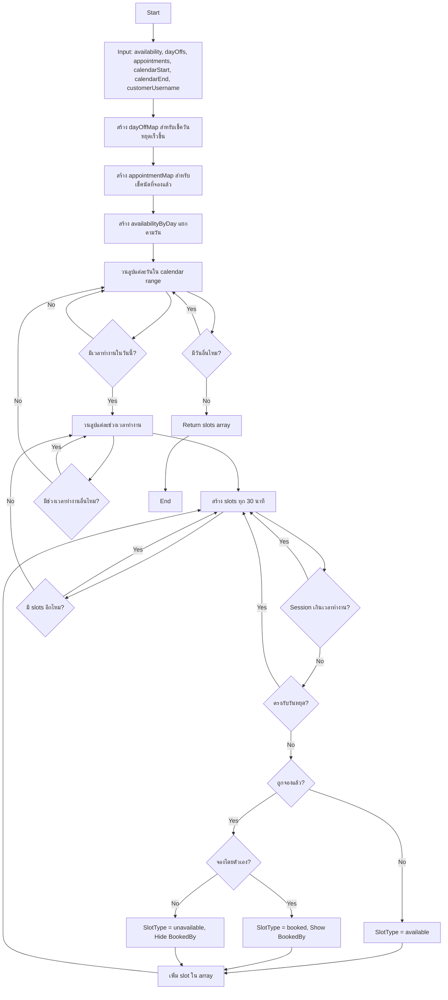

# 📅 Calculate Available Slots - Logic Documentation

> **สำหรับ Developer**  
> Algorithm: `calculateAvailableSlots` function  
> Updated: October 31, 2025

---

## 📋 Table of Contents

1. [Overview](#overview)
2. [Algorithm Flow](#algorithm-flow)
3. [Input Parameters](#input-parameters)
4. [Output Format](#output-format)
5. [Step-by-Step Logic](#step-by-step-logic)
6. [Edge Cases](#edge-cases)
7. [Performance Considerations](#performance-considerations)
8. [Examples](#examples)

---

## Overview

ฟังก์ชัน `calculateAvailableSlots` คำนวณ Booking Slots ที่พร้อมให้จองโดยใช้ข้อมูลจาก:
- **Q2C.2:** เวลาทำงานประจำสัปดาห์ (Training Availability)
- **Q2C.3:** วันหยุด (Day Offs)
- **Q2C.3:** นัดที่จองแล้ว (Appointments)

### Business Rules:
1. ✅ Session = 2 ชั่วโมง (120 นาที)
2. ✅ Slots ระยะห่าง 30 นาที (30-minute intervals)
3. ✅ ลบ Slots ที่ตรงกับวันหยุด
4. ✅ แสดง Slots ที่ตัวเองจองเป็นสีเทา "Booked"
5. ✅ ไม่แสดงรายละเอียดของนัดที่คนอื่นจอง

---

## Algorithm Flow



---

## Input Parameters

### 1. `availability []repositories.TrainerAvailabilityInfo`
เวลาทำงานประจำสัปดาห์ของเทรนเนอร์

```go
type TrainerAvailabilityInfo struct {
    TrainerUsername string
    DayOfWeek       string    // "MONDAY", "TUESDAY", ...
    StartTime       time.Time // เวลาเริ่มต้น (เก็บเฉพาะ time)
    EndTime         time.Time // เวลาสิ้นสุด (เก็บเฉพาะ time)
}
```

**Example:**
```json
[
  {
    "trainerUsername": "trainer1",
    "dayOfWeek": "MONDAY",
    "startTime": "2025-10-31T09:00:00Z",
    "endTime": "2025-10-31T17:00:00Z"
  }
]
```

### 2. `dayOffs []repositories.ScheduleTimeSlot`
วันหยุดหรือช่วงเวลาที่ไม่รับนัด

```go
type ScheduleTimeSlot struct {
    StartTime time.Time // วันเวลาเริ่มต้น
    EndTime   time.Time // วันเวลาสิ้นสุด
}
```

**Example:**
```json
[
  {
    "startTime": "2025-11-06T00:00:00Z",
    "endTime": "2025-11-06T23:59:59Z"
  }
]
```

### 3. `appointments []repositories.AppointmentInfo`
นัดหมายที่ถูกจองแล้ว

```go
type AppointmentInfo struct {
    ID               int32
    StartTime        time.Time
    EndTime          time.Time
    CustomerUsername string
}
```

**Example:**
```json
[
  {
    "id": 5007,
    "startTime": "2025-11-01T09:00:00Z",
    "endTime": "2025-11-01T11:00:00Z",
    "customerUsername": "cust01"
  }
]
```

### 4. `calendarStart, calendarEnd time.Time`
ช่วงเวลาที่ต้องการคำนวณ slots

**Example:**
```go
calendarStart := time.Date(2025, 11, 1, 0, 0, 0, 0, time.UTC)
calendarEnd := time.Date(2025, 11, 30, 23, 59, 59, 0, time.UTC)
```

### 5. `customerUsername string`
Username ของลูกค้าที่เข้าดู (สำหรับกรองนัดของตัวเอง)

---

## Output Format

```go
type BookingSlot struct {
    ID        int32     `json:"id"`
    StartTime time.Time `json:"startTime"`
    EndTime   time.Time `json:"endTime"`   // StartTime + 2 hours
    Available bool      `json:"available"`
    IsBooked  bool      `json:"isBooked"`  // true if this customer booked
    BookedBy  string    `json:"bookedBy"`  // Customer username (only if booked by this customer)
    SlotType  string    `json:"slotType"`  // "available", "booked", "unavailable"
}
```

### SlotType Values:
- **`"available"`** - Slot ว่าง สามารถจองได้
- **`"booked"`** - Slot ที่ตัวเองจองไว้แล้ว (แสดงเป็นสีเทา + "Booked")
- **`"unavailable"`** - Slot ที่คนอื่นจองไว้ (ไม่แสดงชื่อผู้จอง)

---

## Step-by-Step Logic

### Step 1: สร้าง Maps สำหรับ Fast Lookup

#### 1.1 Day Off Map
```go
dayOffMap := make(map[string]bool)
for _, dayOff := range dayOffs {
    current := dayOff.StartTime
    for current.Before(dayOff.EndTime) {
        key := current.Format("2006-01-02 15:04")
        dayOffMap[key] = true
        current = current.Add(time.Minute)
    }
}
```

**Purpose:** เช็ควันหยุดในเวลา O(1) แทนที่จะวนลูป array
**Key Format:** `"2025-11-06 00:00"` (YYYY-MM-DD HH:MM)

#### 1.2 Appointment Map
```go
appointmentMap := make(map[string]*repositories.AppointmentInfo)
for i := range appointments {
    appt := &appointments[i]
    current := appt.StartTime
    for current.Before(appt.EndTime) {
        key := current.Format("2006-01-02 15:04")
        appointmentMap[key] = appt
        current = current.Add(time.Minute)
    }
}
```

**Purpose:** เช็คนัดที่จองแล้วในเวลา O(1)
**Value:** เก็บ pointer เพื่อดึง CustomerUsername

#### 1.3 Availability By Day Map
```go
availabilityByDay := make(map[string][]repositories.TrainerAvailabilityInfo)
for _, avail := range availability {
    availabilityByDay[avail.DayOfWeek] = append(availabilityByDay[avail.DayOfWeek], avail)
}
```

**Purpose:** หาเวลาทำงานตามวันเร็วขึ้น
**Key:** `"MONDAY"`, `"TUESDAY"`, etc.

---

### Step 2: วนลูปแต่ละวันใน Calendar Range

```go
for currentDate := calendarStart; currentDate.Before(calendarEnd) || currentDate.Equal(calendarEnd); currentDate = currentDate.AddDate(0, 0, 1) {
    // หาว่าวันนี้เป็นวันอะไร
    dayOfWeek := u.getDayOfWeekString(currentDate.Weekday())
    
    // เช็คว่ามีเวลาทำงานหรือไม่
    dayAvailabilities, hasAvailability := availabilityByDay[dayOfWeek]
    if !hasAvailability {
        continue // ไม่มีเวลาทำงานในวันนี้
    }
    
    // ...
}
```

**Example:**
- วันที่ 1 พ.ย. 2025 (Friday) → เช็ค `availabilityByDay["FRIDAY"]`
- ถ้าไม่มี → ข้ามวันนี้ไป

---

### Step 3: สร้าง Slots ทุก 30 นาที

```go
for _, avail := range dayAvailabilities {
    // แปลงเวลาทำงานให้ตรงกับวันที่ปัจจุบัน
    workStartTime := time.Date(
        currentDate.Year(), currentDate.Month(), currentDate.Day(),
        avail.StartTime.Hour(), avail.StartTime.Minute(), 0, 0,
        currentDate.Location(),
    )
    workEndTime := time.Date(
        currentDate.Year(), currentDate.Month(), currentDate.Day(),
        avail.EndTime.Hour(), avail.EndTime.Minute(), 0, 0,
        currentDate.Location(),
    )
    
    // สร้าง slots ทุก 30 นาที
    for slotStart := workStartTime; slotStart.Before(workEndTime); slotStart = slotStart.Add(30 * time.Minute) {
        sessionEnd := slotStart.Add(120 * time.Minute) // 2 hours
        
        // ถ้า session เกินเวลาทำงาน ให้ข้าม
        if sessionEnd.After(workEndTime) {
            continue
        }
        
        // ...
    }
}
```

**Example:**
- เวลาทำงาน: 09:00 - 17:00
- Slots: 09:00, 09:30, 10:00, ..., 15:00 (ตัวสุดท้ายที่ session จบก่อน 17:00)
- **ข้าม:** 15:30, 16:00, 16:30 (เพราะ session จะเกิน 17:00)

---

### Step 4: ตรวจสอบวันหยุด

```go
isDayOff := false
checkTime := slotStart
for checkTime.Before(sessionEnd) {
    key := checkTime.Format("2006-01-02 15:04")
    if dayOffMap[key] {
        isDayOff = true
        break
    }
    checkTime = checkTime.Add(time.Minute)
}

if isDayOff {
    continue // ข้าม slot ที่ตรงกับวันหยุด
}
```

**Logic:**
- เช็คทุกนาทีในช่วง 2 ชั่วโมงของ session
- ถ้ามีนาทีใดนาทีหนึ่งตรงกับวันหยุด → ข้าม slot นี้

**Example:**
- Slot: 2025-11-06 10:00 - 12:00
- วันหยุด: 2025-11-06 00:00 - 23:59
- Result: ข้าม (เพราะทุกนาทีใน slot ตรงกับวันหยุด)

---

### Step 5: ตรวจสอบนัดที่จองแล้ว

```go
isBooked := false
bookedBy := ""

checkTime = slotStart
for checkTime.Before(sessionEnd) {
    key := checkTime.Format("2006-01-02 15:04")
    if appt, exists := appointmentMap[key]; exists {
        isBooked = true
        bookedBy = appt.CustomerUsername
        break
    }
    checkTime = checkTime.Add(time.Minute)
}
```

**Logic:**
- เช็คทุกนาทีในช่วง 2 ชั่วโมงของ session
- ถ้ามีนาทีใดนาทีหนึ่งตรงกับนัด → slot นี้ถูกจองแล้ว

**Example:**
- Slot: 2025-11-01 09:00 - 11:00
- นัด: 2025-11-01 09:00 - 11:00 (โดย cust01)
- Result: `isBooked = true, bookedBy = "cust01"`

---

### Step 6: กำหนด SlotType

```go
slotType := "available"
available := true

if isBooked {
    available = false
    if customerUsername != "" && bookedBy == customerUsername {
        slotType = "booked"      // จองโดยตัวเอง
    } else {
        slotType = "unavailable" // จองโดยคนอื่น
        bookedBy = ""            // ซ่อนชื่อคนอื่น
    }
}
```

**Decision Table:**

| Booked? | BookedBy == CustomerUsername? | SlotType | Available | BookedBy | แสดงใน UI |
|---------|------------------------------|----------|-----------|----------|-----------|
| No | - | `available` | `true` | `""` | สีเขียว "Available" |
| Yes | Yes | `booked` | `false` | `cust01` | สีเทา "Booked" |
| Yes | No | `unavailable` | `false` | `""` | สีแดง "Unavailable" |

---

### Step 7: สร้าง Slot Object

```go
slot := responses.BookingSlot{
    ID:        slotID,
    StartTime: slotStart,
    EndTime:   sessionEnd,
    Available: available,
    IsBooked:  isBooked && bookedBy == customerUsername,
    BookedBy:  bookedBy,
    SlotType:  slotType,
}

slots = append(slots, slot)
slotID++
```

---

## Edge Cases

### 1. วันที่ไม่มีเวลาทำงาน
**Scenario:** วันอาทิตย์ trainer ไม่ทำงาน  
**Result:** ไม่มี slot ในวันนั้น

### 2. Session เกินเวลาทำงาน
**Scenario:** เวลาทำงาน 09:00-17:00, Slot 16:30  
**Result:** ข้าม (เพราะ session จะจบ 18:30)

### 3. วันหยุดครึ่งวัน
**Scenario:** วันหยุด 12:00-23:59  
**Result:** มี slots ก่อน 12:00 เท่านั้น

### 4. นัดทับซ้อนบางส่วน
**Scenario:**
- Slot A: 10:00-12:00
- นัด: 11:00-13:00
**Result:** Slot A ถูกจองแล้ว (เพราะมีการทับซ้อน)

### 5. Customer ไม่ระบุ username
**Scenario:** `customerUsername = ""`  
**Result:** แสดงทุก slot แต่ไม่แสดง booked slots

---

## Performance Considerations

### Time Complexity
- **Day Off Check:** O(1) per minute (using map)
- **Appointment Check:** O(1) per minute (using map)
- **Overall:** O(D × A × S × 120)
  - D = number of days
  - A = availability slots per day
  - S = number of 30-min slots
  - 120 = minutes in 2-hour session

### Space Complexity
- **dayOffMap:** O(M) where M = total minutes in all day-offs
- **appointmentMap:** O(N × 120) where N = number of appointments
- **Result slots:** O(R) where R = total available slots

### Optimization Techniques
1. ✅ **Hash Maps:** ใช้ map แทน array loops
2. ✅ **Early Exit:** ข้าม slot ทันทีที่เจอวันหยุด/นัด
3. ✅ **Pre-grouping:** จัดกลุ่ม availability ตามวัน

---

## Examples

### Example 1: Basic Calculation

**Input:**
```go
availability := []repositories.TrainerAvailabilityInfo{
    {DayOfWeek: "MONDAY", StartTime: 09:00, EndTime: 17:00},
}
dayOffs := []repositories.ScheduleTimeSlot{}
appointments := []repositories.AppointmentInfo{}
calendarStart := 2025-11-03 (Monday)
calendarEnd := 2025-11-03
customerUsername := "cust01"
```

**Output:**
```json
[
  {"id": 1, "startTime": "2025-11-03T09:00:00Z", "endTime": "2025-11-03T11:00:00Z", "available": true, "slotType": "available"},
  {"id": 2, "startTime": "2025-11-03T09:30:00Z", "endTime": "2025-11-03T11:30:00Z", "available": true, "slotType": "available"},
  {"id": 3, "startTime": "2025-11-03T10:00:00Z", "endTime": "2025-11-03T12:00:00Z", "available": true, "slotType": "available"},
  // ... จนถึง 15:00-17:00
]
```

### Example 2: With Day Off

**Input:**
```go
dayOffs := []repositories.ScheduleTimeSlot{
    {StartTime: "2025-11-03T12:00:00Z", EndTime: "2025-11-03T23:59:59Z"},
}
```

**Output:**
- Slots ก่อน 12:00: `available`
- Slots หลัง 12:00: ไม่แสดง (ข้าม)

### Example 3: With Appointments

**Input:**
```go
appointments := []repositories.AppointmentInfo{
    {ID: 1, StartTime: "2025-11-03T09:00:00Z", EndTime: "2025-11-03T11:00:00Z", CustomerUsername: "cust01"},
    {ID: 2, StartTime: "2025-11-03T10:00:00Z", EndTime: "2025-11-03T12:00:00Z", CustomerUsername: "cust02"},
}
customerUsername := "cust01"
```

**Output:**
```json
[
  {"id": 1, "startTime": "2025-11-03T09:00:00Z", "endTime": "2025-11-03T11:00:00Z", "available": false, "isBooked": true, "bookedBy": "cust01", "slotType": "booked"},
  {"id": 2, "startTime": "2025-11-03T09:30:00Z", "endTime": "2025-11-03T11:30:00Z", "available": false, "isBooked": false, "bookedBy": "", "slotType": "unavailable"},
  {"id": 3, "startTime": "2025-11-03T10:00:00Z", "endTime": "2025-11-03T12:00:00Z", "available": false, "isBooked": false, "bookedBy": "", "slotType": "unavailable"}
]
```

**Explanation:**
- Slot 1 (09:00): จองโดย cust01 → แสดง `"booked"` + ชื่อ
- Slot 2 (09:30): ทับกับนัดของ cust01 และ cust02 → `"unavailable"`
- Slot 3 (10:00): จองโดย cust02 → `"unavailable"` + ซ่อนชื่อ

---

## Testing Checklist

- [ ] ทดสอบวันที่ไม่มีเวลาทำงาน
- [ ] ทดสอบ session เกินเวลาทำงาน
- [ ] ทดสอบวันหยุดเต็มวัน
- [ ] ทดสอบวันหยุดครึ่งวัน
- [ ] ทดสอบนัดทับซ้อน
- [ ] ทดสอบ customer จองหลาย slot
- [ ] ทดสอบ multiple trainers
- [ ] ทดสอบ timezone handling
- [ ] ทดสอบ calendar ข้ามเดือน
- [ ] ทดสอบ performance กับข้อมูลขนาดใหญ่

---

**Status:** ✅ Implementation Complete
